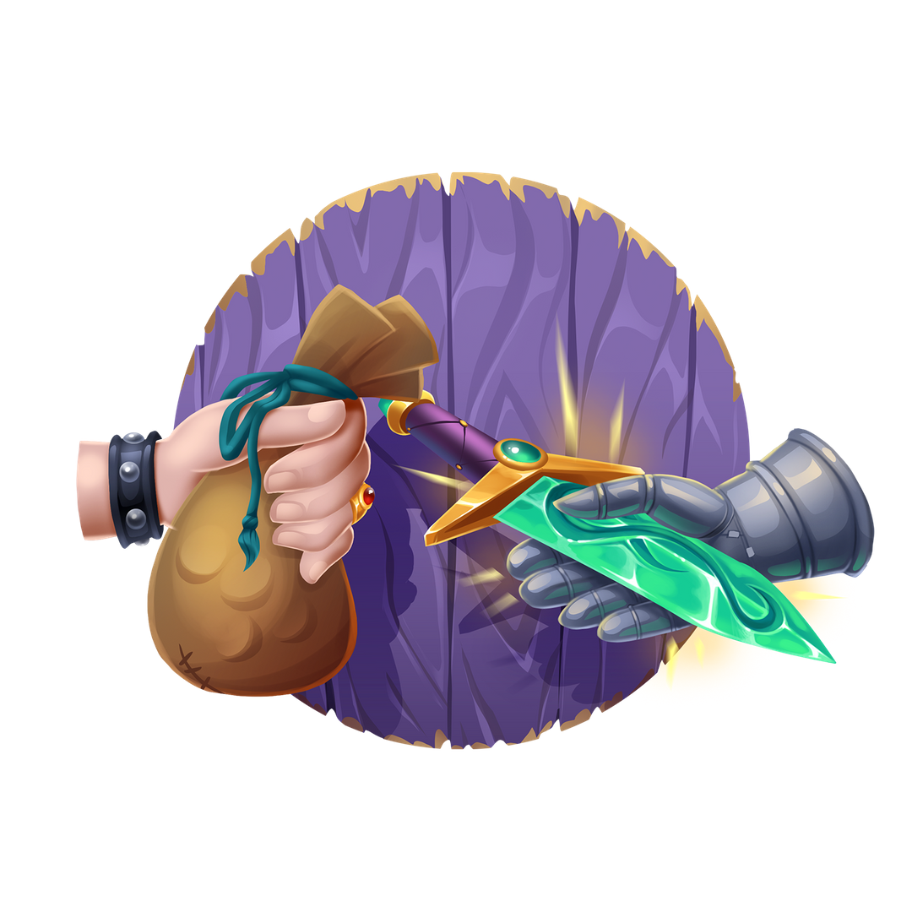
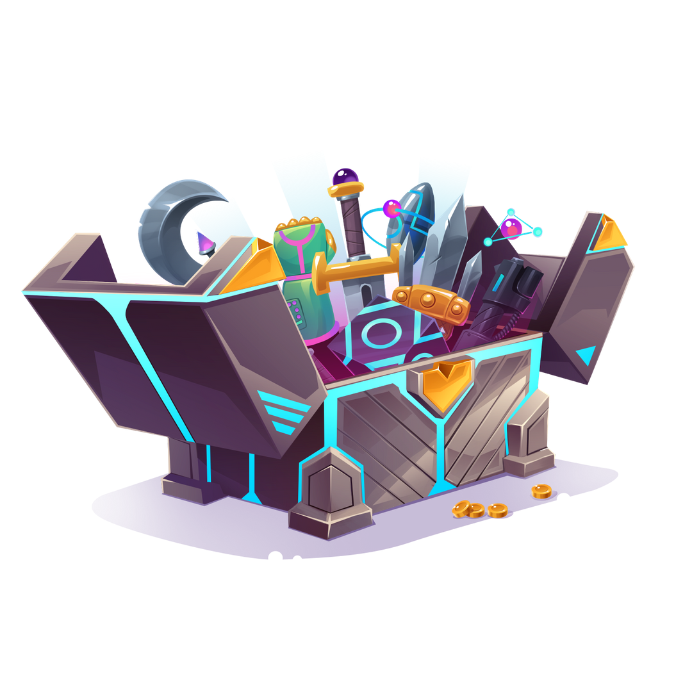

## Find Your Treasure {.section .section--image-row .section--centered}

Discover, buy, and sell rare and unique blockchain assets.

!ActionButton[Sell NFT](/en/offers/create){theme="primary" variant="contained"}
!ActionButton[Buy NFT](/en/offers){theme="secondary" variant="contained"}

## Discover {.section .section--image-row .section--reversed .section--centered columnSize="6:6"}

Find pioneering blockchain projects featuring scarce digital assets.

## Trade {.section .section--image-row .section--centered columnSize="6:6"}

Use the ABT Wallet to easily list and purchase NFT items and collectibles.

!ActionButton[Download ABT Wallet](https://www.abtwallet.io){theme="primary"}

## Collect {.section .section--image-row .section--reversed .section--centered columnSize="6:6"}

Grow your inventory with rare and unique digital treasures.

